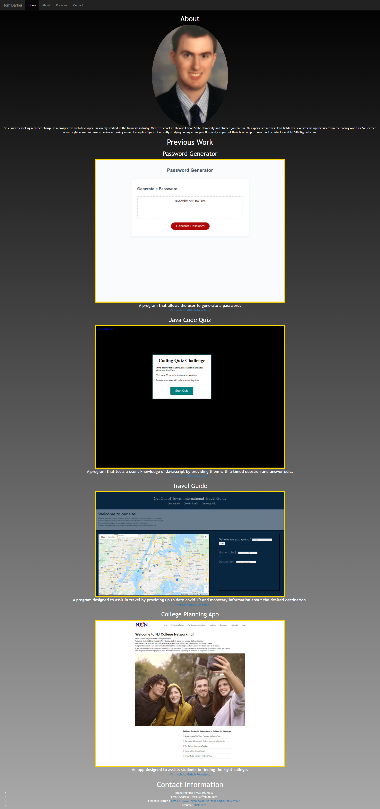

Tom Barber - Portfolio

Description: As a prospective web-developer, a well-made portfolio is a must. To help with that, I was tasked with updating a portfolio I had made in the past. This is the second time that I've updated the website to bring it more in line with what I want.  The changes that I made to this one were smaller than before.  
I was happy with the general layout of the page, and as such I spent the bulk of the time fixing errors in the code that I did not catch last time.  I finally got
the website navbar working, I added a link to the github repositories that go with the pieces I included in the site, and I fixed the link to my resume at the end so that it would show up when someone other than me looked at it.  With these updates, I feel that the website functions a lot better than it does in its previous 
incarnations.  Any future improvements would be to add entirely new functionality instead of improving what's already here.

Website Link: https://trb5160.github.io/Portfolio_3.0/ Github Link: https://github.com/trb5160/Portfolio_3.0.git

License: 

Copyright (c) [2021] [Tom Barber]

Permission is hereby granted, free of charge, to any person obtaining a copy of this software and associated documentation files (the "Software"), to deal in the Software without restriction, including without limitation the rights to use, copy, modify, merge, publish, distribute, sublicense, and/or sell copies of the Software, and to permit persons to whom the Software is furnished to do so, subject to the following conditions:

The above copyright notice and this permission notice shall be included in all copies or substantial portions of the Software.

THE SOFTWARE IS PROVIDED "AS IS", WITHOUT WARRANTY OF ANY KIND, EXPRESS OR IMPLIED, INCLUDING BUT NOT LIMITED TO THE WARRANTIES OF MERCHANTABILITY, FITNESS FOR A PARTICULAR PURPOSE AND NONINFRINGEMENT. IN NO EVENT SHALL THE AUTHORS OR COPYRIGHT HOLDERS BE LIABLE FOR ANY CLAIM, DAMAGES OR OTHER LIABILITY, WHETHER IN AN ACTION OF CONTRACT, TORT OR OTHERWISE, ARISING FROM, OUT OF OR IN CONNECTION WITH THE SOFTWARE OR THE USE OR OTHER DEALINGS IN THE SOFTWARE